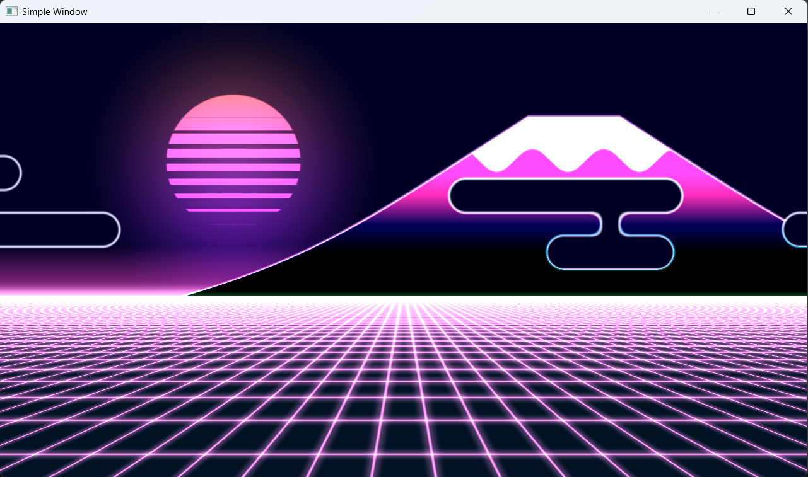

# SimpleGraphics

SimpleGraphics is a console application that demonstrates basic graphics rendering using OpenGL in C#. This project provides a simple example of setting up an OpenGL rendering context, creating a window, loading shaders, and rendering basic shapes.

## Screenshots

### Working example


## Features

- OpenGL Rendering: Utilizes OpenGL for graphics rendering, providing a cross-platform solution for graphics programming.
- Shader Support: Demonstrates loading and compiling vertex and fragment shaders, allowing for customizable graphics rendering effects.
- Basic Geometry: Renders basic shapes such as triangles, allowing users to experiment with different geometries.
- Console Interface: Interaction with the application is done through the console, making it easy to run and control.

## Getting Started

### Prerequisites

- .NET SDK
- OpenTK

### Installation

1. Clone the repository:

```bash
git clone https://github.com/VelSkorp/SimpleGraphics.git
cd SimpleGraphics
```

2. Build and run the project:

```bash
dotnet build
dotnet run
```

### Usage

Upon running the application, you will be presented with options to choose from:

- Render Basic Shapes: Choose an option to render basic shapes such as triangles.
- Load Custom Shaders: Load custom vertex and fragment shaders to apply different rendering effects.
- Exit: Exit the application.

### Dependencies

SimpleGraphics relies on the following dependencies:

- OpenGL: Used for graphics rendering.
- GLFW: Provides a simple API for creating windows, contexts, and handling input.
- OpenTK: Provides bindings for OpenGL in C#.

These dependencies are included in the project and are automatically referenced during compilation.

## Contributing

Contributions to SimpleGraphics are welcome! If you find any issues or have ideas for improvements, feel free to open an issue or submit a pull request on GitHub.

## License

This project is licensed under the MIT License - see the [LICENSE](LICENSE) file for details.

